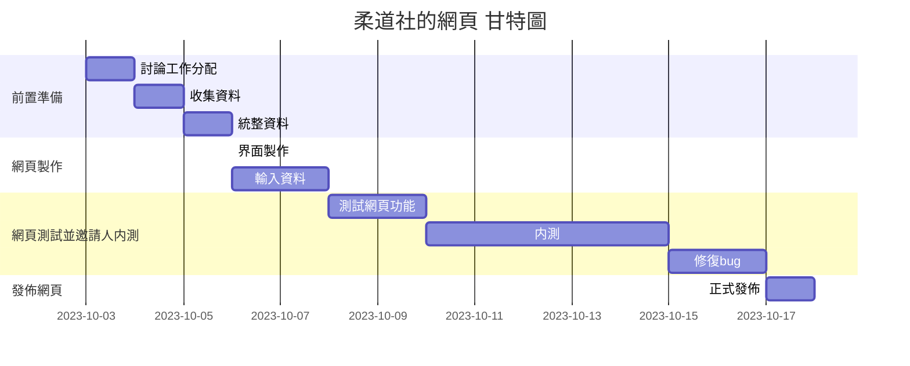
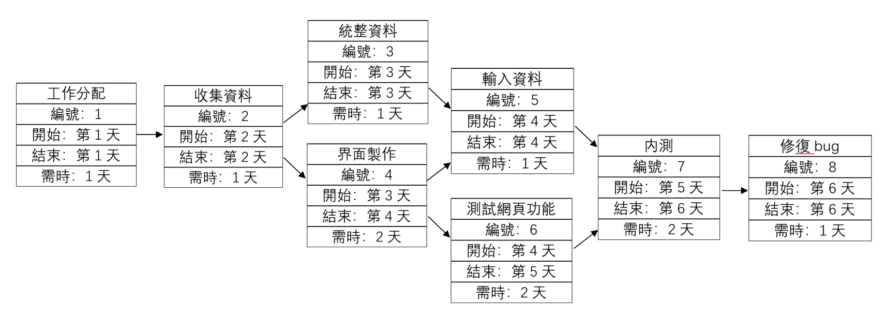

# SAaD TEAM 16

# 專題介紹
### 專題名稱：高科大第一校區柔道社網站
### 目的：推廣柔道，觸及率提高
### 内容：為柔道社製作一個網頁，丟入各種資訊，活動内容，歷届成果等，並推廣柔道。

### 組員名單：
|職位|學號|名字|
|:--:|:--:|:--:|
|*組長*|C110118259|[謝招尉](https://github.com/WEI0527/C11118259)|
|組員|C110118241|[袁佳文](https://github.com/azsx1674/SAaD)|
|組員|C110118245|[林婉儒](https://github.com/subabunbear/C110118245)|

###  組員任務
|名字|任務|
|:--:|:--:|
|謝招尉| 前置準備，内容討論，網頁製作，網頁測試，優化bug，github製作，github整理 |
|袁佳文| 前置準備，内容討論，資料收集，網頁製作，網頁測試，優化bug，github製作 |
|林婉儒| 前置準備，内容討論，資料收集，網頁製作，網頁測試，優化bug，github製作 |

## 柔道社的網頁 甘特圖

     
## 柔道社的網頁 PERT圖
 
## 關鍵路徑：1->2->4->6->7->8
### 溫馨提示:
#### 如看不清圖片請點擊查看大圖
