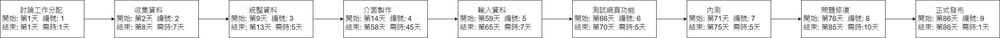
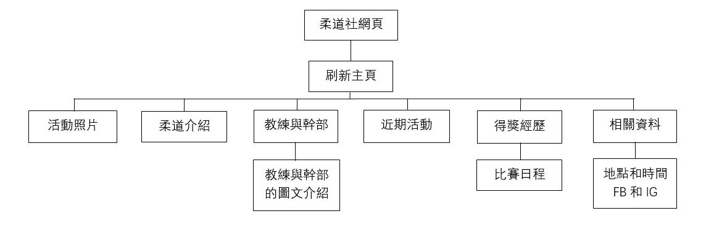

# SAaD TEAM 16

# 專題介紹
### 專題名稱：高科大第一校區柔道社網站
### 目的：推廣柔道，觸及率提高
### 内容：為柔道社製作一個網頁，放入各種資訊、活動内容、歷届成果等，並推廣柔道。

### 組員名單：
|職位|學號|名字|
|:--:|:--:|:--:|
|*組長*|C110118259|[謝招尉](https://github.com/WEI0527/C11118259)|
|組員|C110118241|[袁佳文](https://github.com/azsx1674/SAaD)|
|組員|C110118245|[林婉儒](https://github.com/subabunbear/C110118245)|

###  組員任務
|名字|任務|
|:--:|:--:|
|謝招尉| 前置準備，内容討論，網頁製作，網頁測試，優化bug，github製作，github整理 |
|袁佳文| 前置準備，内容討論，資料收集，網頁製作，網頁測試，優化bug，github製作 |
|林婉儒| 前置準備，内容討論，資料收集，網頁製作，網頁測試，優化bug，github製作 |

## 柔道社的網頁 甘特圖

     
## 柔道社的網頁 PERT圖
 
## 關鍵路徑：1->2->3->4->5->6->7->8->9
### 溫馨提示:
#### 如看不清圖片請點擊查看大圖

## 網頁功能性需求與非功能性需求
#### 
- 功能性需求

1.讓瀏覽者可以瞭解柔道社。

2.網頁必須允許瀏覽者查看已經發布的資訊。

####
- 非功能性需求

1.網頁的回應時間不應超過2秒。

2.網頁必須支持1000個同時在線用戶。

---
## 功能分解圖-Functional Decomposition Diagram

## [Figma_Prototype](https://www.figma.com/file/UHqBpmrJOUcXPbIb45tiTo/%E6%9F%94%E9%81%93%E7%A4%BE%E7%B6%B2%E9%A0%81?type=design&node-id=0-1&mode=design&t=V1VocfQlHoESOcLg-0)

## 需求分析的文字描述
1. 可以進來瞭解社團的資訊
2. 可以找到社團負責教練及幹部
3. 可找到近期活動
4. 瞭解社團内容

---

### 系統環境圖 (DFD)
.png)

---

### DFD 圖0

---

### 案例（一）

|使用者案例名稱||
|:-----:|:---------|
|行動者||
|説明||
|完成動作|
|替代方法||
|先決條件||
|後置條件||
|假設|無|

### 案例（二）

|使用者案例名稱||
|:-----:|:---------|
|行動者||
|説明||
|完成動作|
|替代方法||
|先決條件||
|後置條件||
|假設|無|

### 案例（三）

|使用者案例名稱||
|:-----:|:---------|
|行動者||
|説明||
|完成動作|
|替代方法||
|先決條件||
|後置條件||
|假設|無|

