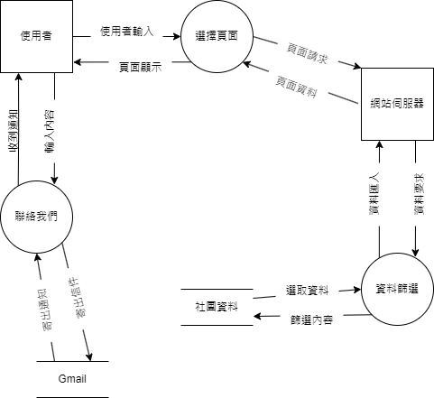

# SAaD TEAM 16

# 專題介紹
### 專題名稱：高科大第一校區柔道社網站
### 目的：推廣柔道，觸及率提高
### 内容：為柔道社製作一個網頁，放入各種資訊、活動内容、歷届成果等，並推廣柔道。

### 組員名單：
|職位|學號|名字|
|:--:|:--:|:--:|
|*組長*|C110118259|[謝招尉](https://github.com/WEI0527/C11118259)|
|組員|C110118241|[袁佳文](https://github.com/azsx1674/SAaD)|
|組員|C110118245|[林婉儒](https://github.com/subabunbear/C110118245)|

###  組員任務
|名字|任務|
|:--:|:--:|
|謝招尉| 前置準備，内容討論，，網頁測試，github製作，github整理 |
|袁佳文| 前置準備，内容討論，資料收集，，網頁測試，github製作 |
|林婉儒| 前置準備，内容討論，資料收集，網頁製作，網頁測試，優化bug |

---

## 柔道社的網頁 甘特圖

---
     
## 柔道社的網頁 PERT圖
 
## 關鍵路徑：1->2->3->4->5->6->7->8->9
### 溫馨提示:
#### 如看不清圖片請點擊查看大圖

---

## 網頁功能性需求與非功能性需求
#### 
- 功能性需求

1.活動頁面展示：詳細介紹即將舉行或已經舉辦的柔道活動，包括訓練、比賽等。

2.成果展示： 以相冊形式展示歷屆柔道社的成果，如比賽獎項、活動照片等。

3.社員介紹： 提供社員介紹的頁面，可以包括成員的照片、簡歷和柔道心得。

4.新聞與通知： 在網站上發布柔道社的最新消息、通知和公告。

####
- 非功能性需求

1.可靠性： 網站應該穩定運行，減少故障和中斷。

2.易用性： 簡單易用的介面，讓使用者能夠輕鬆地找到他們需要的信息。

---

## 功能分解圖-Functional Decomposition Diagram

---

## Figma
<網址>

---

### 繪出UML 類別圖(class Diagram)

---

### 案例（一）

|使用者案例名稱|搜索網站|
|:-----:|:---------|
|行動者|游覽者，社員，幹部，教練|
|説明|透過搜索網站進入使用|
|完成動作|1.寫網頁2.製作資料庫資料3.匯入網頁4.形成網頁
|替代方法|無    |
|先決條件|使用者需處於有網絡的環境|
|後置條件|使用者成功進入網站|
|假設|無|

### 案例（二）

|使用者案例名稱|查看近期活動|
|:-----:|:---------|
|行動者|社員|
|説明|進入網站查找社團近期活動|
|完成動作|1.進入網站2.選擇近期活動選項3.顯示社團最近活動|
|替代方法|無|
|先決條件|使用者需處於有網絡的環境|
|後置條件|使用者進到社團最近活動瞭解|
|假設|無|

### 案例（三）

|使用者案例名稱|更新社團内容|
|:-----:|:---------|
|行動者|幹部|
|説明|幹部進入網站更新最新資訊及内容|
|完成動作|1.將資料匯入資料庫2.進到網站進行更新3.顯示最新資訊内容|
|替代方法|無|
|先決條件|幹部需獲得更改權限才能進入資料庫以及更改網頁内容|
|後置條件|進入網站后系統會自動提醒是否存在bug需要更新或者調整|
|假設|無|

---

## 需求分析的文字描述
1. 可以進來瞭解社團的資訊
2. 可以找到社團負責教練及幹部
3. 可找到近期活動
4. 瞭解社團内容

---

## 系統環境圖 (DFD)

## DFD 圖0

---

## 分鏡板-storyboard

